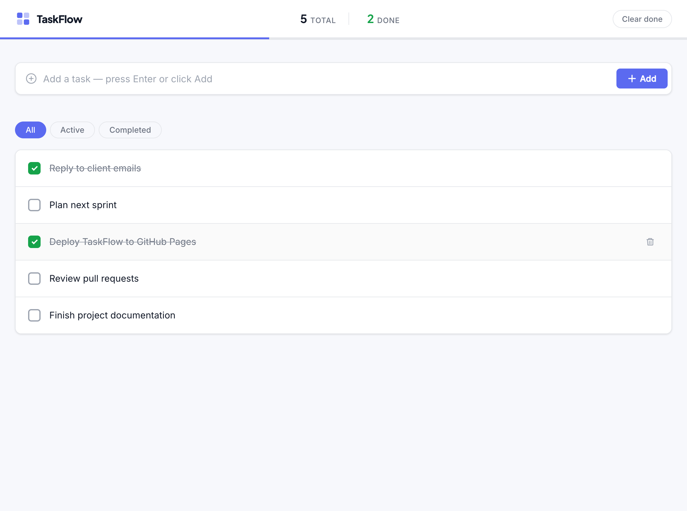
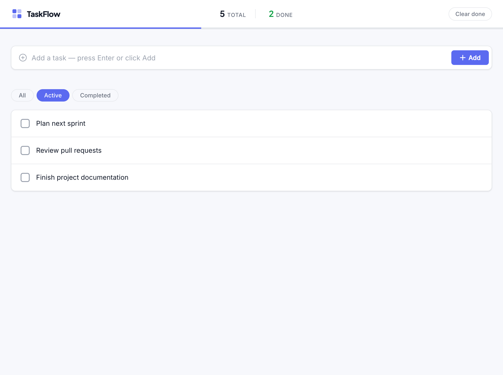
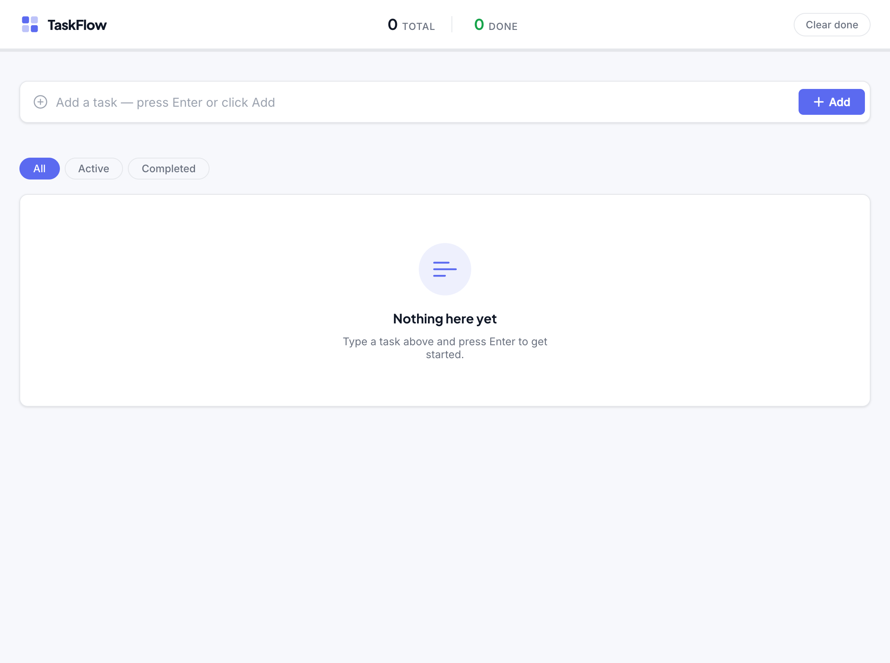

# TaskFlow — Screenshots

A visual tour of the TaskFlow to-do list app.

## Main view (All tasks)

Tasks list with a mix of active and completed items, live total/done stats, and the completion progress bar.

## Active filter

The **Active** filter showing only tasks that still need to be done.

## Empty state

The friendly empty state shown when there are no tasks yet.

